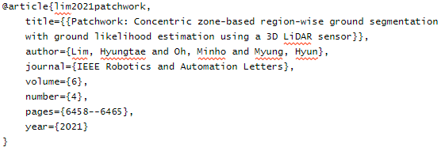
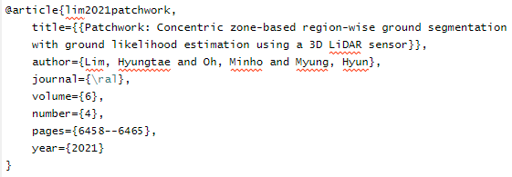

# url_bib_utils
Frequently used abbreviations of conf/journals when writing references by latex

## How to use

1. Clone, or copy and paste `url_bib_utils.sty` into your Latex workspace. Note that the name should be the same as the name in step 2.

2. Add the below command in your main Latex file, i.e. `${YOUR_BIBTEX_FILE}.tex`

```
$ \usepackage{url_bib_utils}
```

3. Replace the journal/booktitle part in each BibTex with the correct abbreviation

For example, in `${YOUR_BIBTEX_FILE}.bib`, change the journal as follows:

**Before**



**After**



And it works! 

